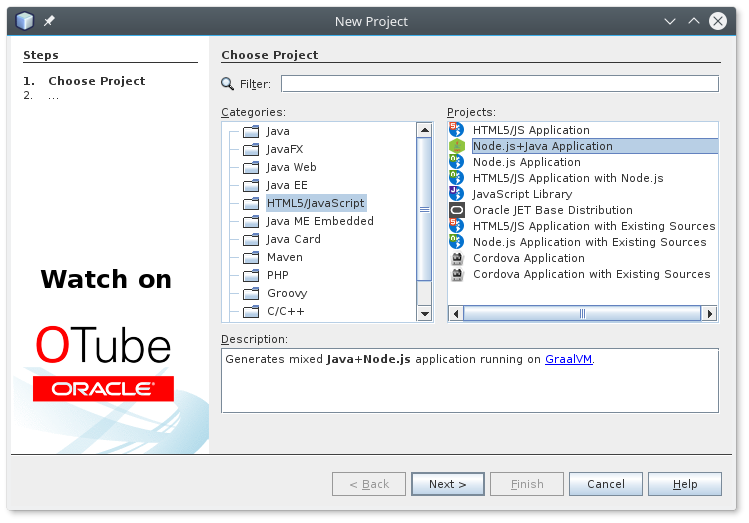

# Node.js+Java Maven Archetype

Java developers are used to their fixed set of tools and working styles.
Often [Maven](http://maven.apache.org) is used as a build tool in the
server side enterprise development. [JUnit](http://junit.org) as a
testing harness and various Maven aware IDEs as a user interface to
access these tools. Changing this workflow is hard, often impossible and
contributes to the rigid stability of many enterprise level projects.

While [GraalVM](http://graalvm.org/) comes
with a compeling **polyglot** story and offers language independent access to
various industry standard frameworks (like [node.js](http://nodejs.org) project)
and smooth integration of these languages in/with **Java**, it provides no *best advices*
or 'getting started' guidelines. It is up to individual users of 
[GraalVM](http://graalvm.org) to figure
everything out by themselves. Given the obstacles of multi language interop and the
fact that it is unique (e.g. not documented on [StackOverflow](http://stackoverflow.com)),
it is hard or even close to impossible to get started.

The **Node.js+Java Maven Archetype** is here to change that. It gives you an
easy way to create a working [Maven](http://maven.apache.org) project with
selected examples that can be edited, compiled, debugged and unit tested in
the context of [GraalVM](http://graalvm.org)'s
[node.js](http://nodejs.org) environment.

## Getting Started

The **Node.js+Java Maven Archetype**
[releases are uploaded to Maven central](http://search.maven.org/#search%7Cga%7C1%7Cg%3A%22com.oracle.graal-js%22%20a%3A%22nodejs-archetype%22) repository. Thus, creation of your
sample project is a matter of a few shell commands.

Change directory into an
*empty folder* and invoke (here is an [example](docs/MavenHowTo.md) of a command
line interaction for [Maven](http://maven.apache.org) newbies):
```bash
$ mvn -DarchetypeGroupId=com.oracle.graal-js \
      -DarchetypeArtifactId=nodejs-archetype \
      -DarchetypeVersion=0.2 \
      archetype:generate \
      -DgraalvmPath=/graalvm-19.0.2/
# and optionaly any of these
      -DalgorithmJava=true \
      -DalgorithmJS=true \
      -DalgorithmRuby=true \
      -DalgorithmR=true \
      -DunitTest=true
```
after [answering few questions](MavenHowTo.md) about the name (e.g. `artifactId`),
`groupId` (something like root package in Java) and version (usually `1.0-SNAPSHOT`,
to accept the default just press enter)
of your project, the skeleton of it gets generated.
Change path to its root directory:
```bash
$ cd yourArtifactId
```
Now it is possible to compile and unit test it and also execute:
```bash
$ mvn package exec:exec -DskipTests
```
The server gets started on port 8080 and you can access it in a browser or
from a command line. By default it just returns the received URL, but (depending
on the selected samples) it also demonstrates how to compute **factorial** in
polyglot languages:
```bash
$ curl http://localhost:8080/test
Received: /test
$ curl http://localhost:8080/java/30
265252859812191058636308480000000
$ curl http://localhost:8080/js/10
3628800
```
In case you enabled [Ruby](https://github.com/oracle/truffleruby) or
[R language](https://github.com/oracle/fastr) you can also try:
```bash
$ curl http://localhost:8080/ruby/100
Received: /ruby/100
$ curl http://localhost:8080/r/5
Received: /r/5
```
The [node.js](http://nodejs.org) runtime spiced with a **polyglot** flavor is now
accessible via your standard **Java** development tooling.

## The Benefits of Polyglot

The generated samples are simple, yet powerful enough to demonstrate the benefits of
**polyglot** runtime like [GraalVM](http://graalvm.org)
over standard, single language runtimes.

### Using Better Arithmetic

Different languages offer different types of numbers. For some computations
using arithmetic from a different language may be beneficial. Just compare:
```bash
$ curl http://localhost:8080/js/50
3.0414093201713376E64
$ curl http://localhost:8080/r/50
3.041409320171302E64
$ curl http://localhost:8080/ruby/50
30414093201713378043612608166064768844377641568960512000000000000
$ curl http://localhost:8080/java/50
30414093201713378043612608166064768844377641568960512000000000000
```
while **JavaScript** and **R** languages use double precision numbers and round
the result of *50!* for bigger numbers. Both **Ruby** and **Java** offer built-in
type numbers (*fixnum* and *BigInteger* respectively) that can handle numbers
with arbitrary precision.

### Better Libraries

Some languages offer better libraries for certain tasks than others. Take
a look at **R** language implementation of factorial - it calls just a single
function (called **factorial** obviously). Of course, it is not hard to
write factorial in any language, but for certian type of tasks there are more
suitable libraries in different languages than one is using primarily.
[GraalVM](http://graalvm.org) let's
you merge them at full speed.

### Multithreadedness of Java

The Java factorial example shows another benefit of using
[GraalVM](http://graalvm.org) -
**Java** is inherently multi-threaded system. As such it is possible to
execute compilation outside of main [node.js](http://nodejs.org) event loop
leaving it free for other computations. Try some long running computation in
background followed by a simple query sent later:
```bash
$ curl http://localhost:8080/java/90000 &
$ curl http://localhost:8080/js/5
120.0
# later the huge result for 90000! is printed
```
**Java** gives us an easy to use paralelism that would be hard to achieve in
a single threaded language like **JavaScript** and environments like
[node.js](http://nodejs.org).

## Contributing

Improvements to the archetype to better show the greatness of synergy between
*Java Virtual Machine* and *node.js* are welcomed. Contribute to this project
by forking [its repository](http://github.com/graalvm/graal-js-archetype).

First step is to compile and register the development version **1.0-SNAPSHOT**
of **Node.js+Java Maven Archetype** into
your local [Maven](http://maven.apache.org) repository. To do so invoke:
```bash
graal-js-archetype$ mvn -f archetype/ clean install -DskipTests
```
Once done, you can start creating your projects. You can use the same
steps as with released versions, just specify **1.0-SNAPSHOT** as
the **archetypeVersion**:
```bash
$ mvn -DarchetypeCatalog=local \
      -DarchetypeGroupId=com.oracle.graal-js \
      -DarchetypeArtifactId=nodejs-archetype \
      -DarchetypeVersion=1.0-SNAPSHOT \
      archetype:generate \
      -DgraalvmPath=/graalvm-19.0.2/
```

Make your modifications in `archetype/src/main/resources/` directory. It
contains the template files which are then processed by
[velocity templating engine](http://velocity.apache.org/) into final form
when instantiating the archetype:
```bash
graal-js-archetype$ find archetype/src/main/resources/
archetype/src/main/resources/archetype-resources/nbactions.xml
archetype/src/main/resources/archetype-resources/pom.xml
archetype/src/main/resources/archetype-resources/src/main/java/Services.java
archetype/src/main/resources/archetype-resources/src/main/js/launcher.js
archetype/src/main/resources/archetype-resources/src/main/js/package.json
archetype/src/main/resources/archetype-resources/src/test/java/ServicesTest.java
archetype/src/main/resources/META-INF/maven/archetype-metadata.xml
```
once your modifications are done, repeat the development steps. Install the
archetype into your local repository, use it and so on, so on.

When you are happy with your changes, invoke the tests that verify the
archetype works in all known configurations:
```bash
graal-js-archetype/archetype$ mvn clean install
```
The tests take a while, yet ensures quality of your contribution.

## UI for the Archetype

Using the Maven Archetype from a command line requires an expert knowledge.
It is way more comfortable to do so from a GUI. There are extensions to
**NetBeans** to simplify the configuration and debugging:



